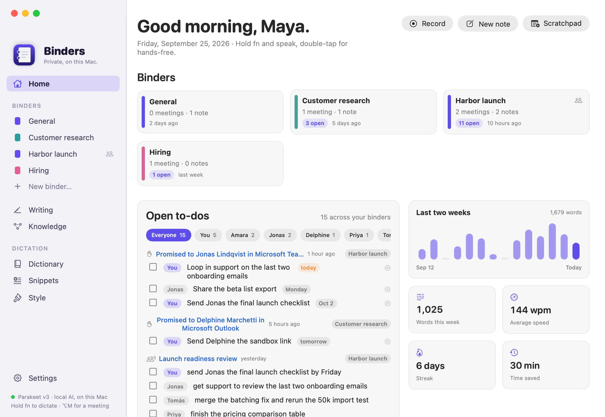
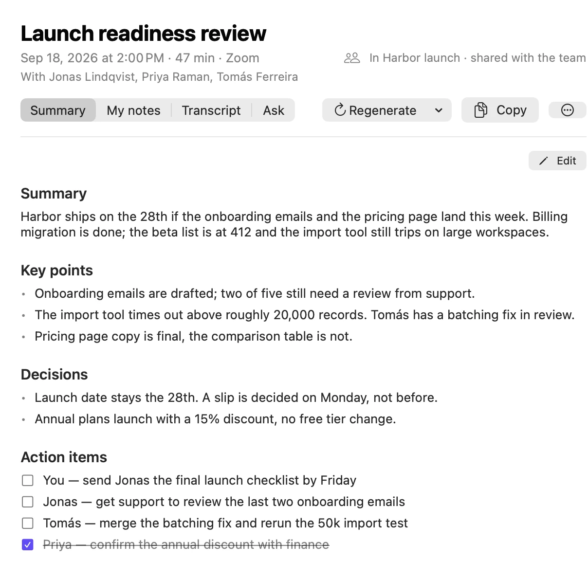
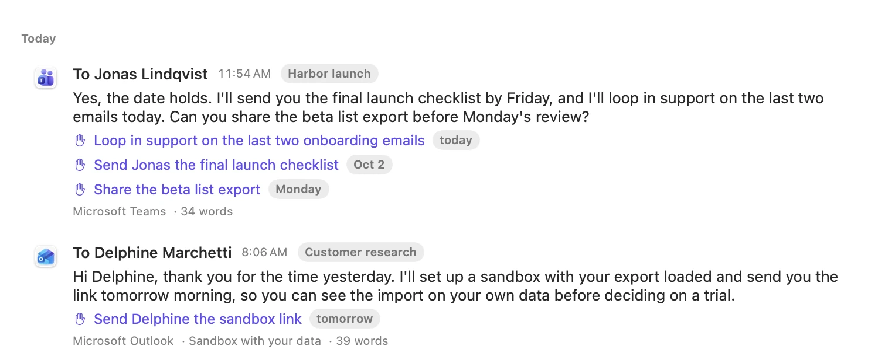
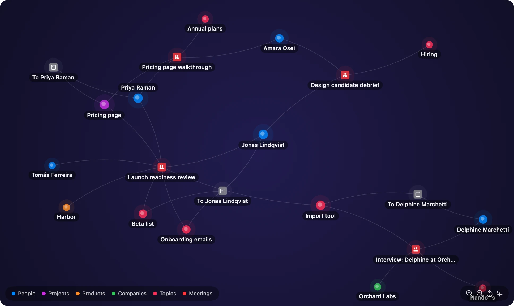
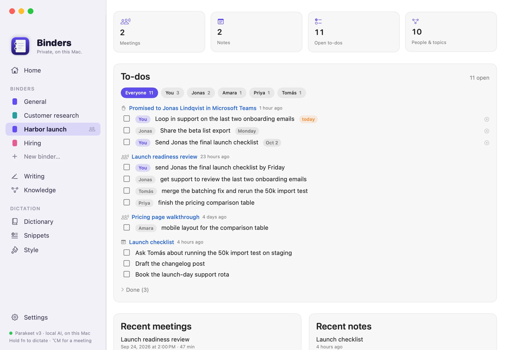

# Binders

**Remembers everything. Tells no one.**

Binders is a free Mac app that turns what you say, what you hear in meetings and what you write into notes, to-dos and a
memory you can ask questions. The speech models, the language model and your data all stay on your Mac.

[](https://github.com/binders-io/mac-app/actions/workflows/tests.yml)
[](https://github.com/binders-io/mac-app/releases/latest)


**Download:** [binders.io](https://binders.io) or the [latest release](https://github.com/binders-io/mac-app/releases/latest) · macOS 14.2 or later · signed and notarized by Apple



| Meeting notes that know who owes what | Promises caught in the messages you send |
|---|---|
|  |  |

| A memory with connections | One binder per thing you are working on |
|---|---|
|  |  |

<sub>Every person and project in these screenshots is fictional. The app renders them from demo data in a throwaway folder.</sub>

## What it does

- **Dictation anywhere.** Hold **fn**, talk, let go. The text lands in whatever app has the cursor, cleaned up: no ums, no false
  starts, and a correction made mid-sentence is the one that sticks. It learns names and jargon from the edits you make, expands
  snippets, and matches the tone of the app you are in. Command Mode (hold **fn ⌃**) rewrites the selected text or answers a question.
- **Meeting notes.** Records your microphone and the other side of a call in any meeting app, or a recording you import, then
  writes a summary, decisions and action items with their owners. Full transcript with speakers, and an Ask tab per meeting.
- **Writing capture.** Switch it on (**fn W**) and Binders keeps what you send in Teams, Outlook, Mail, Slack and your browser,
  at the moment you send it. Keystrokes are never recorded. Promises in those messages ("I'll send it by Friday") become to-dos
  with a deadline and a reminder.
- **Ask your work anything.** Meetings, notes and messages are indexed together and linked into a graph of people, projects and
  topics. Search by meaning, or ask in plain language and get an answer with its sources.
- **Binders and teams.** One binder per thing you are working on. Share a binder with teammates through a folder you already sync
  (OneDrive, Dropbox, Google Drive, iCloud Drive). There is no server of ours in between.

## Privacy

Binders has no account, no analytics and no cloud of its own.

- Speech is transcribed on the Neural Engine with Parakeet or Whisper. Audio is never uploaded.
- Formatting, notes, answers and to-do detection use a language model in [Ollama](https://ollama.com) on your Mac by default.
  Point Binders at another server and that text goes there instead.
- Data lives in ordinary files in `~/Library/Application Support/Binders`, which Settings can open for you.
- Writing capture is off until you switch it on. It never reads secure fields, password managers or terminals, skips pages that
  look like a login or a payment, and redacts labelled passwords, card numbers and long keys before storing anything.
- With your permission, the app checks binders.io for a signed update at most once a day. Nothing about you is sent.

The full breakdown is on the site's privacy page (`site/privacy.html`).

## Requirements

- macOS 14.2 or later. Apple silicon recommended.
- For the AI features, [Ollama](https://ollama.com), or any OpenAI-compatible server. If Ollama is missing, setup offers to
  install it: the official build is downloaded, checked against Ollama's signing team and Apple's notarization, and placed in
  Applications. Binders then picks a Gemma 4 model that
  fits the Mac's memory (`gemma4:e2b-it-qat` on 8 GB, `gemma4:e4b-it-qat` on 16 GB, `gemma4:12b` from 24 GB, `gemma4:26b` from
  48 GB) and offers to download it during setup; Settings → AI changes it. `ollama pull embeddinggemma` adds search by meaning.
  Dictation works without a language model.

## First launch

1. Allow **Microphone** and **Accessibility**. Accessibility is how Binders sees your shortcut in any app, types the result for
   you, and reads the field you are writing in when capture is on.
2. The speech model downloads once (about 500 MB) and is compiled for the Neural Engine.
3. In **System Settings → Keyboard**, set "Press 🌐 key to" to **Do Nothing**, so fn does not also open the emoji picker.
4. Quit any other dictation app that listens to fn. If you used Wispr Flow, the Dictionary page can import your words and snippets.

## Shortcuts

| Shortcut | Action |
|---|---|
| Hold **fn** | Dictate, release to insert |
| Double-tap **fn** | Hands-free; tap fn again to finish |
| Hold **fn ⌃** | Command Mode: rewrite the selection, or ask a question out loud |
| **fn W** | Writing capture on or off |
| **⌥M** | Start or stop meeting notes |
| **⌥S** | Scratchpad |
| **⌃⌘V** | Paste the last transcript again |
| **Esc** | Cancel |

End a dictation with "press enter" to send it. Every shortcut can be changed in Settings.

## Building from source

You need Xcode 16 or later and `brew install xcodegen`.

```sh
xcodegen generate && open Binders.xcodeproj      # develop
scripts/install.sh                               # test, build Release, install to ~/Applications, launch
```

The project signs with the identity named in `project.yml`. Change `DEVELOPMENT_TEAM` and `CODE_SIGN_IDENTITY` to your own; a stable
signature is what lets macOS keep the Accessibility grant across rebuilds. Run `xcodegen generate` again whenever you add a file.

The pure logic lives in a Swift package with its own tests:

```sh
cd Packages/BindersKit && swift test
```

### Test coverage

The logic that can be tested without a microphone or a model lives in the `BindersKit` package: the hotkey state machine, the
dictation and command pipelines, meeting and note parsing, knowledge ranking, promise detection and deadline parsing, redaction,
team sync decisions. Executed 127 tests, with 0 failures. **90.4% of lines** (2652/2935) and **84.1% of functions** (428/509) across 24 source files. Measured on 20 September 2026; every push and pull request runs
the same script, publishes the table in the run summary and fails under 85% of lines.

```sh
scripts/coverage.sh        # tests, then this table
```

<details>
<summary>Coverage by file</summary>

| File | Lines | Covered |
|---|---:|---:|
| `Styles.swift` | 94 | 54.3% |
| `Hotkey.swift` | 246 | 80.9% |
| `PromptBuilder.swift` | 86 | 83.7% |
| `Team.swift` | 235 | 86.0% |
| `VoiceCommands.swift` | 51 | 86.3% |
| `Commitments.swift` | 275 | 87.3% |
| `Pipelines.swift` | 100 | 89.0% |
| `AudioMath.swift` | 100 | 91.0% |
| `Knowledge.swift` | 518 | 91.1% |
| `ModelAdvisor.swift` | 15 | 93.3% |
| `FillerCleaner.swift` | 35 | 94.3% |
| `Meetings.swift` | 510 | 94.9% |
| `TextNorm.swift` | 85 | 95.3% |
| `EditLearner.swift` | 106 | 97.2% |
| `WritingCleanup.swift` | 40 | 97.5% |
| `OutputGuard.swift` | 52 | 98.1% |
| `AudioAlign.swift` | 94 | 100.0% |
| `DictionaryMatcher.swift` | 53 | 100.0% |
| `LoopGuard.swift` | 28 | 100.0% |
| `Notes.swift` | 29 | 100.0% |
| `NotesEditing.swift` | 37 | 100.0% |
| `Redactor.swift` | 83 | 100.0% |
| `SmartSpacing.swift` | 13 | 100.0% |
| `SnippetExpander.swift` | 50 | 100.0% |

</details>

The app layer (audio, Accessibility, speech engines, the language model) is exercised by the headless self-tests below, which run
the real engines, rather than by unit tests.

### Headless self-tests

The app binary can run the real engines without any UI, which is handy after changing prompts or models:

```sh
APP=build/Build/Products/Release/Binders.app/Contents/MacOS/Binders
say -o /tmp/t.wav --data-format=LEI16@16000 "um let's meet at two actually three"
$APP --selftest-audio /tmp/t.wav --bundle com.tinyspeck.slackmacgap     # transcribe and format as if in Slack
$APP --selftest-text "hi john thanks for the contract best maya" --bundle com.apple.mail
$APP --selftest-command "make this shorter" --selection "Some long paragraph…"
$APP --selftest-meeting recording.wav          # transcribe, label speakers and summarize a file
$APP --selftest-commitments message.txt        # which promises and asks the model finds in a message
$APP --selftest-capture-rules                  # the allow, deny and recipient rules of writing capture
$APP --selftest-team                           # two simulated teammates sharing a temporary folder
$APP --selftest-update-check <appcast url>     # does the updater see a newer signed version in this feed
$APP --selftest-model-status [--unload]        # is the language model in memory; free it
$APP --selftest-ollama-install <empty dir>     # the real Ollama download and checks, installed into a throwaway folder
$APP --selftest-ollama-verify <Ollama.app>     # signature and notarization checks only
```

Self-tests that read other apps through Accessibility must be launched with `open -n -W --stdout out.txt Binders.app --args …`;
started from a terminal they inherit the terminal's permissions.

### Releasing

`scripts/release.sh` archives, signs with Developer ID, notarizes, staples, packs the DMG and zip, and writes the signed update
feed. `scripts/deploy-site.sh` publishes the website in `site/` together with the download and the feed. See
[docs/RELEASE.md](docs/RELEASE.md) and [docs/SITE.md](docs/SITE.md). Team sharing is described in [docs/TEAM-SPACE.md](docs/TEAM-SPACE.md).

Website screenshots are rendered by the app from fictional data in a throwaway folder; the seeder refuses to run anywhere else.

## Architecture

```
Packages/BindersKit/      Pure Swift, unit-tested
  Hotkey                   Push-to-talk, double-tap, hands-free and combo state machine
  Pipelines, PromptBuilder Dictation and Command Mode: snippets → dictionary → model → guard → fallback
  Meetings, Notes          Speech chunking, echo filter, speakers, summary prompts and parsing, loop guard
  Knowledge                Chunking, rank fusion, entity extraction, voice lookups, graph layout
  Commitments              Promise and ask detection, deadline parsing ("Friday", "EOD", "in 2 days")
  Redactor, WritingCleanup Secret redaction, signature stripping, name clean-up
  Team                     Team space file format and three-way sync decisions
Binders/
  Core/                    Event-tap hotkeys, audio capture, Accessibility context, paste insertion, writing capture,
                           commitment service
  Speech/                  Parakeet (FluidAudio) and Whisper (WhisperKit) engines
  AI/                      Ollama and OpenAI-compatible clients, formatter
  Data/                    SwiftData store, settings, importer
  Meetings/                System audio tap, recorder, live transcription, notes, views
  Knowledge/               SQLite FTS5 and embeddings index, entity graph, search and ask, views
  Team/                    Sync with a shared cloud folder
  UI/                      Flow bar, menu bar, Home, binders, Writing, Knowledge, Settings, Scratchpad
  App/                     App delegate, updater (Sparkle), self-tests, demo data
site/                     The binders.io website: static HTML, CSS and JavaScript
scripts/                  install, release, deploy, screenshot tooling
```

## Troubleshooting

- **fn does nothing.** Check Settings → Permissions. If the app was moved or re-signed, remove Binders from System Settings →
  Privacy & Security → Accessibility and add it again.
- **Every dictation is pasted twice.** Two dictation apps are listening to fn. Quit the other one.
- **"Pasted without AI formatting".** Ollama is not running or the model is not pulled. The menu bar menu shows the last issue.
- **The first dictation after a break is slow.** The language model is freed after 15 idle minutes by default and loads again when
  you start talking. Settings → AI changes that.
- **Text lands in the wrong place.** Binders pastes into whatever is focused when processing finishes. **⌃⌘V** pastes it again.
- Logs: `log stream --predicate 'subsystem == "io.binders.mac"'`

## Contact

hello@binders.io. Security reports: security@binders.io.

## Licence

Binders is free to use. A licence for the source code has not been chosen yet; until one is, all rights are reserved.
The open-source software and models Binders is built with are listed in `Binders/Resources/Acknowledgements.txt` and on the
site's licences page.
